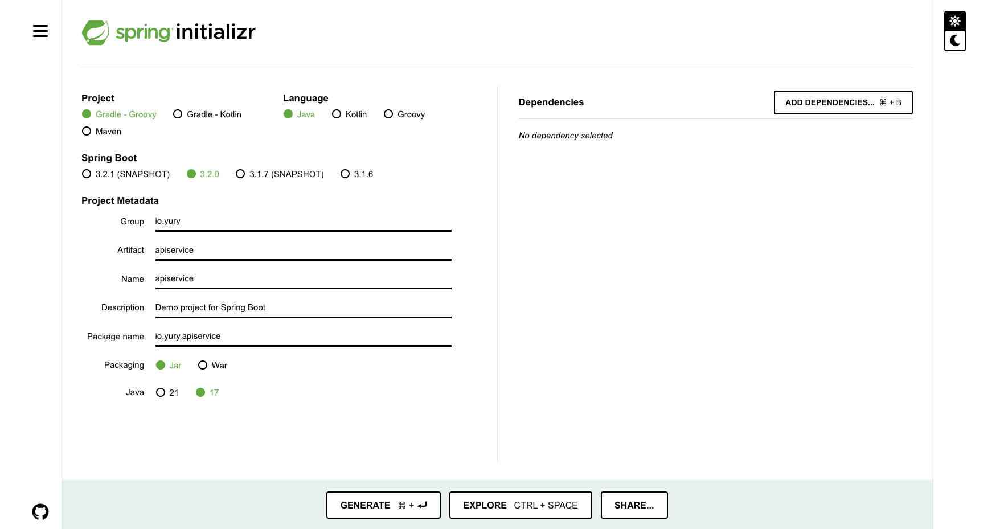
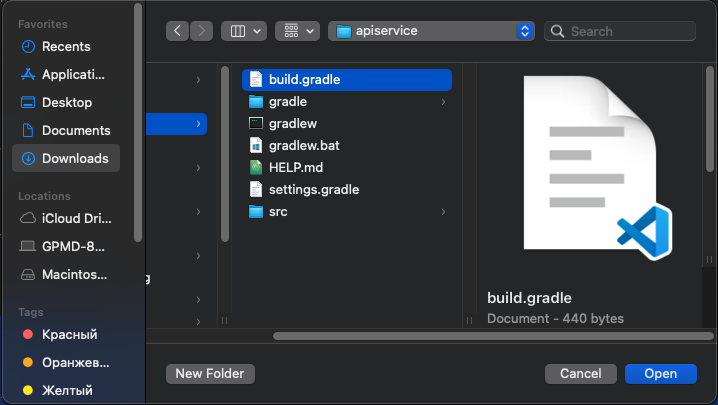
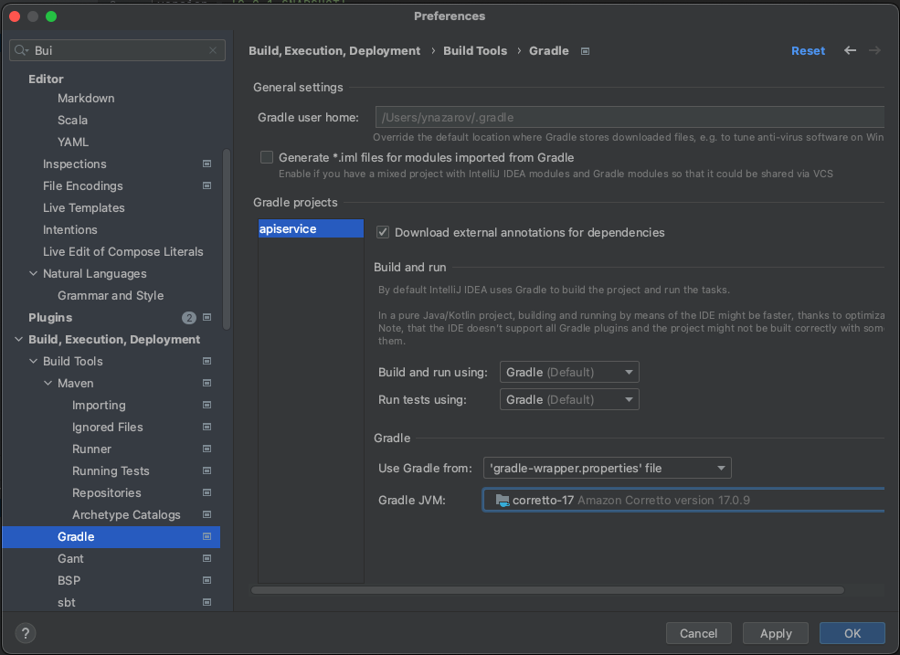
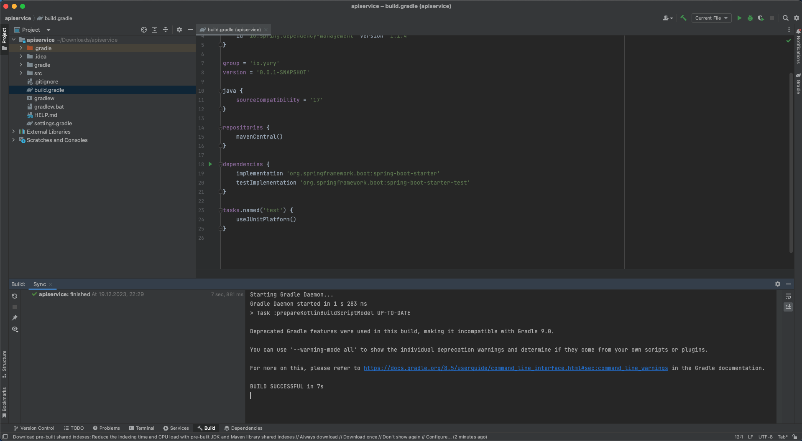

# Пример простого API сервера на Java Spring

Для получения bootstrap архива идем на [https://start.spring.io/]()


Открываем как новый проект файл `build.gradle`


Для gradle укаываем что используем java 17


После приложение должно успешно сбилдится


1. javaClass `WebsiteUser`
```java
package io.yury.apiservice;

import jakarta.persistence.Entity;
import jakarta.persistence.GeneratedValue;
import jakarta.persistence.GenerationType;
import jakarta.persistence.Id;
import lombok.Data;

// Описывает можель данных в БД
@Entity
@Data
public class WebsiteUser {
    @Id
    @GeneratedValue(strategy = GenerationType.AUTO)
    private long id;

    private String name;
    private String email;
}
```

2. Interface `UserRepository`
```java
package io.yury.apiservice;

import org.springframework.data.repository.PagingAndSortingRepository;
import org.springframework.data.repository.query.Param;
import org.springframework.data.rest.core.annotation.RepositoryRestResource;

import java.util.List;

// Описывает ручку users и доступные методы CRUD для нее
@RepositoryRestResource(collectionResourceRel = "users", path = "users")
public interface UserRepository extends PagingAndSortingRepository<WebsiteUser, Long> {
    // Get List Items
    List<WebsiteUser> findByName(@Param("name") String name);

    // Get ById
    WebsiteUser findById(@Param("id") Long id);

    // POST
    WebsiteUser save(WebsiteUser entity);

    // Delete ById
    void deleteById(@Param("id") Long id);
}
```
3. JavaClass SpringDataRestApplication

```java
package io.yury.apiservice;

import org.springframework.boot.SpringApplication;
import org.springframework.boot.autoconfigure.SpringBootApplication;

// Запускает приложение
@SpringBootApplication
public class SpringDataRestApplication {
    public static void main(String[] args) {
        SpringApplication.run(SpringDataRestApplication.class, args);
    }
}
```

4. После по ручке: `http://127.0.0.1:8080/users`
```json
{
  "_embedded" : {
    "users" : [ ]
  },
  "_links" : {
    "self" : {
      "href" : "http://127.0.0.1:8080/users?page=0&size=20"
    },
    "profile" : {
      "href" : "http://127.0.0.1:8080/profile/users"
    },
    "search" : {
      "href" : "http://127.0.0.1:8080/users/search"
    }
  },
  "page" : {
    "size" : 20,
    "totalElements" : 0,
    "totalPages" : 0,
    "number" : 0
  }
}
```

5. Добавляем: `curl -i -X POST -H "Content-Type:application/json" -d '{  "name" : "Test", "email" : "test@test.com" }' http://localhost:8080/users`
```shell
HTTP/1.1 201
Vary: Origin
Vary: Access-Control-Request-Method
Vary: Access-Control-Request-Headers
Location: http://localhost:8080/users/1
Content-Type: application/hal+json
Transfer-Encoding: chunked
Date: Tue, 19 Dec 2023 19:40:30 GMT

{
  "name" : "Test",
  "email" : "test@test.com",
  "_links" : {
    "self" : {
      "href" : "http://localhost:8080/users/1"
    },
    "websiteUser" : {
      "href" : "http://localhost:8080/users/1"
    }
  }
}%
```

6. Проверяем
```json
{
  "_embedded" : {
    "users" : [ {
      "name" : "Test",
      "email" : "test@test.com",
      "_links" : {
        "self" : {
          "href" : "http://127.0.0.1:8080/users/1"
        },
        "websiteUser" : {
          "href" : "http://127.0.0.1:8080/users/1"
        }
      }
    } ]
  },
  "_links" : {
    "self" : {
      "href" : "http://127.0.0.1:8080/users?page=0&size=20"
    },
    "profile" : {
      "href" : "http://127.0.0.1:8080/profile/users"
    },
    "search" : {
      "href" : "http://127.0.0.1:8080/users/search"
    }
  },
  "page" : {
    "size" : 20,
    "totalElements" : 1,
    "totalPages" : 1,
    "number" : 0
  }
}
```

7. Удаляем: `curl -i -X DELETE  http://localhost:8080/users/1`
```shell
➜  ~ curl -i -X DELETE  http://localhost:8080/users/1
HTTP/1.1 200
Vary: Origin
Vary: Access-Control-Request-Method
Vary: Access-Control-Request-Headers
Content-Type: application/hal+json
Transfer-Encoding: chunked
Date: Tue, 19 Dec 2023 19:41:41 GMT

{
  "name" : "Test",
  "email" : "test@test.com",
  "_links" : {
    "self" : {
      "href" : "http://localhost:8080/users/1"
    },
    "websiteUser" : {
      "href" : "http://localhost:8080/users/1"
    }
  }
}%
```

8. Добавляем метрки: `application.yml`
```yaml
management:
  endpoints:
    web:
      exposure:
        include: health,prometheus
  metrics:
    export:
      prometheus:
        enabled: true
    distribution:
      percentiles-histogram:
        "[http.server.requests]": true
```

В build.gradle
```shell
implementation 'io.micrometer:micrometer-registry-prometheus'
```

9. Теперь по ручке: `http://localhost:8080/actuator/prometheus`
<details>
<summary>Metrics</summary>

```
# HELP application_started_time_seconds Time taken to start the application
# TYPE application_started_time_seconds gauge
application_started_time_seconds{main_application_class="io.yury.apiservice.SpringDataRestApplication",} 5.412
# HELP tomcat_sessions_active_current_sessions  
# TYPE tomcat_sessions_active_current_sessions gauge
tomcat_sessions_active_current_sessions 0.0
# HELP executor_pool_max_threads The maximum allowed number of threads in the pool
# TYPE executor_pool_max_threads gauge
executor_pool_max_threads{name="applicationTaskExecutor",} 2.147483647E9
# HELP hikaricp_connections_timeout_total Connection timeout total count
# TYPE hikaricp_connections_timeout_total counter
hikaricp_connections_timeout_total{pool="HikariPool-1",} 0.0
# HELP process_files_open_files The open file descriptor count
# TYPE process_files_open_files gauge
process_files_open_files 101.0
# HELP jvm_classes_unloaded_classes_total The total number of classes unloaded since the Java virtual machine has started execution
# TYPE jvm_classes_unloaded_classes_total counter
jvm_classes_unloaded_classes_total 0.0
# HELP tomcat_sessions_expired_sessions_total  
# TYPE tomcat_sessions_expired_sessions_total counter
tomcat_sessions_expired_sessions_total 0.0
# HELP process_files_max_files The maximum file descriptor count
# TYPE process_files_max_files gauge
process_files_max_files 10240.0
# HELP jvm_compilation_time_ms_total The approximate accumulated elapsed time spent in compilation
# TYPE jvm_compilation_time_ms_total counter
jvm_compilation_time_ms_total{compiler="HotSpot 64-Bit Tiered Compilers",} 15876.0
# HELP http_server_requests_seconds  
# TYPE http_server_requests_seconds histogram
http_server_requests_seconds_bucket{error="none",exception="none",method="GET",outcome="SUCCESS",status="200",uri="/",le="0.001",} 0.0
http_server_requests_seconds_bucket{error="none",exception="none",method="GET",outcome="SUCCESS",status="200",uri="/",le="0.001048576",} 0.0
http_server_requests_seconds_bucket{error="none",exception="none",method="GET",outcome="SUCCESS",status="200",uri="/",le="0.001398101",} 0.0
http_server_requests_seconds_bucket{error="none",exception="none",method="GET",outcome="SUCCESS",status="200",uri="/",le="0.001747626",} 0.0
http_server_requests_seconds_bucket{error="none",exception="none",method="GET",outcome="SUCCESS",status="200",uri="/",le="0.002097151",} 0.0
http_server_requests_seconds_bucket{error="none",exception="none",method="GET",outcome="SUCCESS",status="200",uri="/",le="0.002446676",} 0.0
http_server_requests_seconds_bucket{error="none",exception="none",method="GET",outcome="SUCCESS",status="200",uri="/",le="0.002796201",} 0.0
http_server_requests_seconds_bucket{error="none",exception="none",method="GET",outcome="SUCCESS",status="200",uri="/",le="0.003145726",} 0.0
http_server_requests_seconds_bucket{error="none",exception="none",method="GET",outcome="SUCCESS",status="200",uri="/",le="0.003495251",} 0.0
http_server_requests_seconds_bucket{error="none",exception="none",method="GET",outcome="SUCCESS",status="200",uri="/",le="0.003844776",} 0.0
http_server_requests_seconds_bucket{error="none",exception="none",method="GET",outcome="SUCCESS",status="200",uri="/",le="0.004194304",} 0.0
http_server_requests_seconds_bucket{error="none",exception="none",method="GET",outcome="SUCCESS",status="200",uri="/",le="0.005592405",} 0.0
http_server_requests_seconds_bucket{error="none",exception="none",method="GET",outcome="SUCCESS",status="200",uri="/",le="0.006990506",} 0.0
http_server_requests_seconds_bucket{error="none",exception="none",method="GET",outcome="SUCCESS",status="200",uri="/",le="0.008388607",} 0.0
http_server_requests_seconds_bucket{error="none",exception="none",method="GET",outcome="SUCCESS",status="200",uri="/",le="0.009786708",} 0.0
http_server_requests_seconds_bucket{error="none",exception="none",method="GET",outcome="SUCCESS",status="200",uri="/",le="0.011184809",} 0.0
http_server_requests_seconds_bucket{error="none",exception="none",method="GET",outcome="SUCCESS",status="200",uri="/",le="0.01258291",} 0.0
http_server_requests_seconds_bucket{error="none",exception="none",method="GET",outcome="SUCCESS",status="200",uri="/",le="0.013981011",} 0.0
http_server_requests_seconds_bucket{error="none",exception="none",method="GET",outcome="SUCCESS",status="200",uri="/",le="0.015379112",} 0.0
http_server_requests_seconds_bucket{error="none",exception="none",method="GET",outcome="SUCCESS",status="200",uri="/",le="0.016777216",} 0.0
http_server_requests_seconds_bucket{error="none",exception="none",method="GET",outcome="SUCCESS",status="200",uri="/",le="0.022369621",} 0.0
http_server_requests_seconds_bucket{error="none",exception="none",method="GET",outcome="SUCCESS",status="200",uri="/",le="0.027962026",} 0.0
http_server_requests_seconds_bucket{error="none",exception="none",method="GET",outcome="SUCCESS",status="200",uri="/",le="0.033554431",} 0.0
http_server_requests_seconds_bucket{error="none",exception="none",method="GET",outcome="SUCCESS",status="200",uri="/",le="0.039146836",} 0.0
http_server_requests_seconds_bucket{error="none",exception="none",method="GET",outcome="SUCCESS",status="200",uri="/",le="0.044739241",} 0.0
http_server_requests_seconds_bucket{error="none",exception="none",method="GET",outcome="SUCCESS",status="200",uri="/",le="0.050331646",} 0.0
http_server_requests_seconds_bucket{error="none",exception="none",method="GET",outcome="SUCCESS",status="200",uri="/",le="0.055924051",} 0.0
http_server_requests_seconds_bucket{error="none",exception="none",method="GET",outcome="SUCCESS",status="200",uri="/",le="0.061516456",} 0.0
http_server_requests_seconds_bucket{error="none",exception="none",method="GET",outcome="SUCCESS",status="200",uri="/",le="0.067108864",} 0.0
http_server_requests_seconds_bucket{error="none",exception="none",method="GET",outcome="SUCCESS",status="200",uri="/",le="0.089478485",} 0.0
http_server_requests_seconds_bucket{error="none",exception="none",method="GET",outcome="SUCCESS",status="200",uri="/",le="0.111848106",} 0.0
http_server_requests_seconds_bucket{error="none",exception="none",method="GET",outcome="SUCCESS",status="200",uri="/",le="0.134217727",} 1.0
http_server_requests_seconds_bucket{error="none",exception="none",method="GET",outcome="SUCCESS",status="200",uri="/",le="0.156587348",} 1.0
http_server_requests_seconds_bucket{error="none",exception="none",method="GET",outcome="SUCCESS",status="200",uri="/",le="0.178956969",} 1.0
http_server_requests_seconds_bucket{error="none",exception="none",method="GET",outcome="SUCCESS",status="200",uri="/",le="0.20132659",} 1.0
http_server_requests_seconds_bucket{error="none",exception="none",method="GET",outcome="SUCCESS",status="200",uri="/",le="0.223696211",} 1.0
http_server_requests_seconds_bucket{error="none",exception="none",method="GET",outcome="SUCCESS",status="200",uri="/",le="0.246065832",} 1.0
http_server_requests_seconds_bucket{error="none",exception="none",method="GET",outcome="SUCCESS",status="200",uri="/",le="0.268435456",} 1.0
http_server_requests_seconds_bucket{error="none",exception="none",method="GET",outcome="SUCCESS",status="200",uri="/",le="0.357913941",} 1.0
http_server_requests_seconds_bucket{error="none",exception="none",method="GET",outcome="SUCCESS",status="200",uri="/",le="0.447392426",} 1.0
http_server_requests_seconds_bucket{error="none",exception="none",method="GET",outcome="SUCCESS",status="200",uri="/",le="0.536870911",} 1.0
http_server_requests_seconds_bucket{error="none",exception="none",method="GET",outcome="SUCCESS",status="200",uri="/",le="0.626349396",} 1.0
http_server_requests_seconds_bucket{error="none",exception="none",method="GET",outcome="SUCCESS",status="200",uri="/",le="0.715827881",} 1.0
http_server_requests_seconds_bucket{error="none",exception="none",method="GET",outcome="SUCCESS",status="200",uri="/",le="0.805306366",} 1.0
http_server_requests_seconds_bucket{error="none",exception="none",method="GET",outcome="SUCCESS",status="200",uri="/",le="0.894784851",} 1.0
http_server_requests_seconds_bucket{error="none",exception="none",method="GET",outcome="SUCCESS",status="200",uri="/",le="0.984263336",} 1.0
http_server_requests_seconds_bucket{error="none",exception="none",method="GET",outcome="SUCCESS",status="200",uri="/",le="1.073741824",} 1.0
http_server_requests_seconds_bucket{error="none",exception="none",method="GET",outcome="SUCCESS",status="200",uri="/",le="1.431655765",} 1.0
http_server_requests_seconds_bucket{error="none",exception="none",method="GET",outcome="SUCCESS",status="200",uri="/",le="1.789569706",} 1.0
http_server_requests_seconds_bucket{error="none",exception="none",method="GET",outcome="SUCCESS",status="200",uri="/",le="2.147483647",} 1.0
http_server_requests_seconds_bucket{error="none",exception="none",method="GET",outcome="SUCCESS",status="200",uri="/",le="2.505397588",} 1.0
http_server_requests_seconds_bucket{error="none",exception="none",method="GET",outcome="SUCCESS",status="200",uri="/",le="2.863311529",} 1.0
http_server_requests_seconds_bucket{error="none",exception="none",method="GET",outcome="SUCCESS",status="200",uri="/",le="3.22122547",} 1.0
http_server_requests_seconds_bucket{error="none",exception="none",method="GET",outcome="SUCCESS",status="200",uri="/",le="3.579139411",} 1.0
http_server_requests_seconds_bucket{error="none",exception="none",method="GET",outcome="SUCCESS",status="200",uri="/",le="3.937053352",} 1.0
http_server_requests_seconds_bucket{error="none",exception="none",method="GET",outcome="SUCCESS",status="200",uri="/",le="4.294967296",} 1.0
http_server_requests_seconds_bucket{error="none",exception="none",method="GET",outcome="SUCCESS",status="200",uri="/",le="5.726623061",} 1.0
http_server_requests_seconds_bucket{error="none",exception="none",method="GET",outcome="SUCCESS",status="200",uri="/",le="7.158278826",} 1.0
http_server_requests_seconds_bucket{error="none",exception="none",method="GET",outcome="SUCCESS",status="200",uri="/",le="8.589934591",} 1.0
http_server_requests_seconds_bucket{error="none",exception="none",method="GET",outcome="SUCCESS",status="200",uri="/",le="10.021590356",} 1.0
http_server_requests_seconds_bucket{error="none",exception="none",method="GET",outcome="SUCCESS",status="200",uri="/",le="11.453246121",} 1.0
http_server_requests_seconds_bucket{error="none",exception="none",method="GET",outcome="SUCCESS",status="200",uri="/",le="12.884901886",} 1.0
http_server_requests_seconds_bucket{error="none",exception="none",method="GET",outcome="SUCCESS",status="200",uri="/",le="14.316557651",} 1.0
http_server_requests_seconds_bucket{error="none",exception="none",method="GET",outcome="SUCCESS",status="200",uri="/",le="15.748213416",} 1.0
http_server_requests_seconds_bucket{error="none",exception="none",method="GET",outcome="SUCCESS",status="200",uri="/",le="17.179869184",} 1.0
http_server_requests_seconds_bucket{error="none",exception="none",method="GET",outcome="SUCCESS",status="200",uri="/",le="22.906492245",} 1.0
http_server_requests_seconds_bucket{error="none",exception="none",method="GET",outcome="SUCCESS",status="200",uri="/",le="28.633115306",} 1.0
http_server_requests_seconds_bucket{error="none",exception="none",method="GET",outcome="SUCCESS",status="200",uri="/",le="30.0",} 1.0
http_server_requests_seconds_bucket{error="none",exception="none",method="GET",outcome="SUCCESS",status="200",uri="/",le="+Inf",} 1.0
http_server_requests_seconds_count{error="none",exception="none",method="GET",outcome="SUCCESS",status="200",uri="/",} 1.0
http_server_requests_seconds_sum{error="none",exception="none",method="GET",outcome="SUCCESS",status="200",uri="/",} 0.118981562
http_server_requests_seconds_bucket{error="none",exception="none",method="GET",outcome="CLIENT_ERROR",status="404",uri="/**",le="0.001",} 0.0
http_server_requests_seconds_bucket{error="none",exception="none",method="GET",outcome="CLIENT_ERROR",status="404",uri="/**",le="0.001048576",} 0.0
http_server_requests_seconds_bucket{error="none",exception="none",method="GET",outcome="CLIENT_ERROR",status="404",uri="/**",le="0.001398101",} 0.0
http_server_requests_seconds_bucket{error="none",exception="none",method="GET",outcome="CLIENT_ERROR",status="404",uri="/**",le="0.001747626",} 0.0
http_server_requests_seconds_bucket{error="none",exception="none",method="GET",outcome="CLIENT_ERROR",status="404",uri="/**",le="0.002097151",} 0.0
http_server_requests_seconds_bucket{error="none",exception="none",method="GET",outcome="CLIENT_ERROR",status="404",uri="/**",le="0.002446676",} 0.0
http_server_requests_seconds_bucket{error="none",exception="none",method="GET",outcome="CLIENT_ERROR",status="404",uri="/**",le="0.002796201",} 0.0
http_server_requests_seconds_bucket{error="none",exception="none",method="GET",outcome="CLIENT_ERROR",status="404",uri="/**",le="0.003145726",} 0.0
http_server_requests_seconds_bucket{error="none",exception="none",method="GET",outcome="CLIENT_ERROR",status="404",uri="/**",le="0.003495251",} 1.0
http_server_requests_seconds_bucket{error="none",exception="none",method="GET",outcome="CLIENT_ERROR",status="404",uri="/**",le="0.003844776",} 1.0
http_server_requests_seconds_bucket{error="none",exception="none",method="GET",outcome="CLIENT_ERROR",status="404",uri="/**",le="0.004194304",} 1.0
http_server_requests_seconds_bucket{error="none",exception="none",method="GET",outcome="CLIENT_ERROR",status="404",uri="/**",le="0.005592405",} 1.0
http_server_requests_seconds_bucket{error="none",exception="none",method="GET",outcome="CLIENT_ERROR",status="404",uri="/**",le="0.006990506",} 1.0
http_server_requests_seconds_bucket{error="none",exception="none",method="GET",outcome="CLIENT_ERROR",status="404",uri="/**",le="0.008388607",} 1.0
http_server_requests_seconds_bucket{error="none",exception="none",method="GET",outcome="CLIENT_ERROR",status="404",uri="/**",le="0.009786708",} 2.0
http_server_requests_seconds_bucket{error="none",exception="none",method="GET",outcome="CLIENT_ERROR",status="404",uri="/**",le="0.011184809",} 2.0
http_server_requests_seconds_bucket{error="none",exception="none",method="GET",outcome="CLIENT_ERROR",status="404",uri="/**",le="0.01258291",} 2.0
http_server_requests_seconds_bucket{error="none",exception="none",method="GET",outcome="CLIENT_ERROR",status="404",uri="/**",le="0.013981011",} 2.0
http_server_requests_seconds_bucket{error="none",exception="none",method="GET",outcome="CLIENT_ERROR",status="404",uri="/**",le="0.015379112",} 2.0
http_server_requests_seconds_bucket{error="none",exception="none",method="GET",outcome="CLIENT_ERROR",status="404",uri="/**",le="0.016777216",} 2.0
http_server_requests_seconds_bucket{error="none",exception="none",method="GET",outcome="CLIENT_ERROR",status="404",uri="/**",le="0.022369621",} 2.0
http_server_requests_seconds_bucket{error="none",exception="none",method="GET",outcome="CLIENT_ERROR",status="404",uri="/**",le="0.027962026",} 2.0
http_server_requests_seconds_bucket{error="none",exception="none",method="GET",outcome="CLIENT_ERROR",status="404",uri="/**",le="0.033554431",} 2.0
http_server_requests_seconds_bucket{error="none",exception="none",method="GET",outcome="CLIENT_ERROR",status="404",uri="/**",le="0.039146836",} 2.0
http_server_requests_seconds_bucket{error="none",exception="none",method="GET",outcome="CLIENT_ERROR",status="404",uri="/**",le="0.044739241",} 2.0
http_server_requests_seconds_bucket{error="none",exception="none",method="GET",outcome="CLIENT_ERROR",status="404",uri="/**",le="0.050331646",} 2.0
http_server_requests_seconds_bucket{error="none",exception="none",method="GET",outcome="CLIENT_ERROR",status="404",uri="/**",le="0.055924051",} 2.0
http_server_requests_seconds_bucket{error="none",exception="none",method="GET",outcome="CLIENT_ERROR",status="404",uri="/**",le="0.061516456",} 2.0
http_server_requests_seconds_bucket{error="none",exception="none",method="GET",outcome="CLIENT_ERROR",status="404",uri="/**",le="0.067108864",} 2.0
http_server_requests_seconds_bucket{error="none",exception="none",method="GET",outcome="CLIENT_ERROR",status="404",uri="/**",le="0.089478485",} 2.0
http_server_requests_seconds_bucket{error="none",exception="none",method="GET",outcome="CLIENT_ERROR",status="404",uri="/**",le="0.111848106",} 2.0
http_server_requests_seconds_bucket{error="none",exception="none",method="GET",outcome="CLIENT_ERROR",status="404",uri="/**",le="0.134217727",} 2.0
http_server_requests_seconds_bucket{error="none",exception="none",method="GET",outcome="CLIENT_ERROR",status="404",uri="/**",le="0.156587348",} 2.0
http_server_requests_seconds_bucket{error="none",exception="none",method="GET",outcome="CLIENT_ERROR",status="404",uri="/**",le="0.178956969",} 2.0
http_server_requests_seconds_bucket{error="none",exception="none",method="GET",outcome="CLIENT_ERROR",status="404",uri="/**",le="0.20132659",} 2.0
http_server_requests_seconds_bucket{error="none",exception="none",method="GET",outcome="CLIENT_ERROR",status="404",uri="/**",le="0.223696211",} 2.0
http_server_requests_seconds_bucket{error="none",exception="none",method="GET",outcome="CLIENT_ERROR",status="404",uri="/**",le="0.246065832",} 2.0
http_server_requests_seconds_bucket{error="none",exception="none",method="GET",outcome="CLIENT_ERROR",status="404",uri="/**",le="0.268435456",} 2.0
http_server_requests_seconds_bucket{error="none",exception="none",method="GET",outcome="CLIENT_ERROR",status="404",uri="/**",le="0.357913941",} 2.0
http_server_requests_seconds_bucket{error="none",exception="none",method="GET",outcome="CLIENT_ERROR",status="404",uri="/**",le="0.447392426",} 2.0
http_server_requests_seconds_bucket{error="none",exception="none",method="GET",outcome="CLIENT_ERROR",status="404",uri="/**",le="0.536870911",} 2.0
http_server_requests_seconds_bucket{error="none",exception="none",method="GET",outcome="CLIENT_ERROR",status="404",uri="/**",le="0.626349396",} 2.0
http_server_requests_seconds_bucket{error="none",exception="none",method="GET",outcome="CLIENT_ERROR",status="404",uri="/**",le="0.715827881",} 2.0
http_server_requests_seconds_bucket{error="none",exception="none",method="GET",outcome="CLIENT_ERROR",status="404",uri="/**",le="0.805306366",} 2.0
http_server_requests_seconds_bucket{error="none",exception="none",method="GET",outcome="CLIENT_ERROR",status="404",uri="/**",le="0.894784851",} 2.0
http_server_requests_seconds_bucket{error="none",exception="none",method="GET",outcome="CLIENT_ERROR",status="404",uri="/**",le="0.984263336",} 2.0
http_server_requests_seconds_bucket{error="none",exception="none",method="GET",outcome="CLIENT_ERROR",status="404",uri="/**",le="1.073741824",} 2.0
http_server_requests_seconds_bucket{error="none",exception="none",method="GET",outcome="CLIENT_ERROR",status="404",uri="/**",le="1.431655765",} 2.0
http_server_requests_seconds_bucket{error="none",exception="none",method="GET",outcome="CLIENT_ERROR",status="404",uri="/**",le="1.789569706",} 2.0
http_server_requests_seconds_bucket{error="none",exception="none",method="GET",outcome="CLIENT_ERROR",status="404",uri="/**",le="2.147483647",} 2.0
http_server_requests_seconds_bucket{error="none",exception="none",method="GET",outcome="CLIENT_ERROR",status="404",uri="/**",le="2.505397588",} 2.0
http_server_requests_seconds_bucket{error="none",exception="none",method="GET",outcome="CLIENT_ERROR",status="404",uri="/**",le="2.863311529",} 2.0
http_server_requests_seconds_bucket{error="none",exception="none",method="GET",outcome="CLIENT_ERROR",status="404",uri="/**",le="3.22122547",} 2.0
http_server_requests_seconds_bucket{error="none",exception="none",method="GET",outcome="CLIENT_ERROR",status="404",uri="/**",le="3.579139411",} 2.0
http_server_requests_seconds_bucket{error="none",exception="none",method="GET",outcome="CLIENT_ERROR",status="404",uri="/**",le="3.937053352",} 2.0
http_server_requests_seconds_bucket{error="none",exception="none",method="GET",outcome="CLIENT_ERROR",status="404",uri="/**",le="4.294967296",} 2.0
http_server_requests_seconds_bucket{error="none",exception="none",method="GET",outcome="CLIENT_ERROR",status="404",uri="/**",le="5.726623061",} 2.0
http_server_requests_seconds_bucket{error="none",exception="none",method="GET",outcome="CLIENT_ERROR",status="404",uri="/**",le="7.158278826",} 2.0
http_server_requests_seconds_bucket{error="none",exception="none",method="GET",outcome="CLIENT_ERROR",status="404",uri="/**",le="8.589934591",} 2.0
http_server_requests_seconds_bucket{error="none",exception="none",method="GET",outcome="CLIENT_ERROR",status="404",uri="/**",le="10.021590356",} 2.0
http_server_requests_seconds_bucket{error="none",exception="none",method="GET",outcome="CLIENT_ERROR",status="404",uri="/**",le="11.453246121",} 2.0
http_server_requests_seconds_bucket{error="none",exception="none",method="GET",outcome="CLIENT_ERROR",status="404",uri="/**",le="12.884901886",} 2.0
http_server_requests_seconds_bucket{error="none",exception="none",method="GET",outcome="CLIENT_ERROR",status="404",uri="/**",le="14.316557651",} 2.0
http_server_requests_seconds_bucket{error="none",exception="none",method="GET",outcome="CLIENT_ERROR",status="404",uri="/**",le="15.748213416",} 2.0
http_server_requests_seconds_bucket{error="none",exception="none",method="GET",outcome="CLIENT_ERROR",status="404",uri="/**",le="17.179869184",} 2.0
http_server_requests_seconds_bucket{error="none",exception="none",method="GET",outcome="CLIENT_ERROR",status="404",uri="/**",le="22.906492245",} 2.0
http_server_requests_seconds_bucket{error="none",exception="none",method="GET",outcome="CLIENT_ERROR",status="404",uri="/**",le="28.633115306",} 2.0
http_server_requests_seconds_bucket{error="none",exception="none",method="GET",outcome="CLIENT_ERROR",status="404",uri="/**",le="30.0",} 2.0
http_server_requests_seconds_bucket{error="none",exception="none",method="GET",outcome="CLIENT_ERROR",status="404",uri="/**",le="+Inf",} 2.0
http_server_requests_seconds_count{error="none",exception="none",method="GET",outcome="CLIENT_ERROR",status="404",uri="/**",} 2.0
http_server_requests_seconds_sum{error="none",exception="none",method="GET",outcome="CLIENT_ERROR",status="404",uri="/**",} 0.012391492
# HELP http_server_requests_seconds_max  
# TYPE http_server_requests_seconds_max gauge
http_server_requests_seconds_max{error="none",exception="none",method="GET",outcome="SUCCESS",status="200",uri="/",} 0.118981562
http_server_requests_seconds_max{error="none",exception="none",method="GET",outcome="CLIENT_ERROR",status="404",uri="/**",} 0.009212395
# HELP jvm_gc_memory_allocated_bytes_total Incremented for an increase in the size of the (young) heap memory pool after one GC to before the next
# TYPE jvm_gc_memory_allocated_bytes_total counter
jvm_gc_memory_allocated_bytes_total 0.0
# HELP hikaricp_connections_acquire_seconds Connection acquire time
# TYPE hikaricp_connections_acquire_seconds summary
hikaricp_connections_acquire_seconds_count{pool="HikariPool-1",} 0.0
hikaricp_connections_acquire_seconds_sum{pool="HikariPool-1",} 0.0
# HELP hikaricp_connections_acquire_seconds_max Connection acquire time
# TYPE hikaricp_connections_acquire_seconds_max gauge
hikaricp_connections_acquire_seconds_max{pool="HikariPool-1",} 0.0
# HELP executor_queue_remaining_tasks The number of additional elements that this queue can ideally accept without blocking
# TYPE executor_queue_remaining_tasks gauge
executor_queue_remaining_tasks{name="applicationTaskExecutor",} 2.147483647E9
# HELP http_server_requests_active_seconds_max  
# TYPE http_server_requests_active_seconds_max gauge
http_server_requests_active_seconds_max{exception="none",method="GET",outcome="SUCCESS",status="200",uri="UNKNOWN",} 0.028000903
# HELP http_server_requests_active_seconds  
# TYPE http_server_requests_active_seconds histogram
http_server_requests_active_seconds_bucket{exception="none",method="GET",outcome="SUCCESS",status="200",uri="UNKNOWN",le="120.0",} 1.0
http_server_requests_active_seconds_bucket{exception="none",method="GET",outcome="SUCCESS",status="200",uri="UNKNOWN",le="137.438953471",} 1.0
http_server_requests_active_seconds_bucket{exception="none",method="GET",outcome="SUCCESS",status="200",uri="UNKNOWN",le="160.345445716",} 1.0
http_server_requests_active_seconds_bucket{exception="none",method="GET",outcome="SUCCESS",status="200",uri="UNKNOWN",le="183.251937961",} 1.0
http_server_requests_active_seconds_bucket{exception="none",method="GET",outcome="SUCCESS",status="200",uri="UNKNOWN",le="206.158430206",} 1.0
http_server_requests_active_seconds_bucket{exception="none",method="GET",outcome="SUCCESS",status="200",uri="UNKNOWN",le="229.064922451",} 1.0
http_server_requests_active_seconds_bucket{exception="none",method="GET",outcome="SUCCESS",status="200",uri="UNKNOWN",le="251.971414696",} 1.0
http_server_requests_active_seconds_bucket{exception="none",method="GET",outcome="SUCCESS",status="200",uri="UNKNOWN",le="274.877906944",} 1.0
http_server_requests_active_seconds_bucket{exception="none",method="GET",outcome="SUCCESS",status="200",uri="UNKNOWN",le="366.503875925",} 1.0
http_server_requests_active_seconds_bucket{exception="none",method="GET",outcome="SUCCESS",status="200",uri="UNKNOWN",le="458.129844906",} 1.0
http_server_requests_active_seconds_bucket{exception="none",method="GET",outcome="SUCCESS",status="200",uri="UNKNOWN",le="549.755813887",} 1.0
http_server_requests_active_seconds_bucket{exception="none",method="GET",outcome="SUCCESS",status="200",uri="UNKNOWN",le="641.381782868",} 1.0
http_server_requests_active_seconds_bucket{exception="none",method="GET",outcome="SUCCESS",status="200",uri="UNKNOWN",le="733.007751849",} 1.0
http_server_requests_active_seconds_bucket{exception="none",method="GET",outcome="SUCCESS",status="200",uri="UNKNOWN",le="824.63372083",} 1.0
http_server_requests_active_seconds_bucket{exception="none",method="GET",outcome="SUCCESS",status="200",uri="UNKNOWN",le="916.259689811",} 1.0
http_server_requests_active_seconds_bucket{exception="none",method="GET",outcome="SUCCESS",status="200",uri="UNKNOWN",le="1007.885658792",} 1.0
http_server_requests_active_seconds_bucket{exception="none",method="GET",outcome="SUCCESS",status="200",uri="UNKNOWN",le="1099.511627776",} 1.0
http_server_requests_active_seconds_bucket{exception="none",method="GET",outcome="SUCCESS",status="200",uri="UNKNOWN",le="1466.015503701",} 1.0
http_server_requests_active_seconds_bucket{exception="none",method="GET",outcome="SUCCESS",status="200",uri="UNKNOWN",le="1832.519379626",} 1.0
http_server_requests_active_seconds_bucket{exception="none",method="GET",outcome="SUCCESS",status="200",uri="UNKNOWN",le="2199.023255551",} 1.0
http_server_requests_active_seconds_bucket{exception="none",method="GET",outcome="SUCCESS",status="200",uri="UNKNOWN",le="2565.527131476",} 1.0
http_server_requests_active_seconds_bucket{exception="none",method="GET",outcome="SUCCESS",status="200",uri="UNKNOWN",le="2932.031007401",} 1.0
http_server_requests_active_seconds_bucket{exception="none",method="GET",outcome="SUCCESS",status="200",uri="UNKNOWN",le="3298.534883326",} 1.0
http_server_requests_active_seconds_bucket{exception="none",method="GET",outcome="SUCCESS",status="200",uri="UNKNOWN",le="3665.038759251",} 1.0
http_server_requests_active_seconds_bucket{exception="none",method="GET",outcome="SUCCESS",status="200",uri="UNKNOWN",le="4031.542635176",} 1.0
http_server_requests_active_seconds_bucket{exception="none",method="GET",outcome="SUCCESS",status="200",uri="UNKNOWN",le="4398.046511104",} 1.0
http_server_requests_active_seconds_bucket{exception="none",method="GET",outcome="SUCCESS",status="200",uri="UNKNOWN",le="5864.062014805",} 1.0
http_server_requests_active_seconds_bucket{exception="none",method="GET",outcome="SUCCESS",status="200",uri="UNKNOWN",le="7200.0",} 1.0
http_server_requests_active_seconds_bucket{exception="none",method="GET",outcome="SUCCESS",status="200",uri="UNKNOWN",le="+Inf",} 1.0
http_server_requests_active_seconds_active_count{exception="none",method="GET",outcome="SUCCESS",status="200",uri="UNKNOWN",} 1.0
http_server_requests_active_seconds_duration_sum{exception="none",method="GET",outcome="SUCCESS",status="200",uri="UNKNOWN",} 0.027973872
# HELP jvm_buffer_memory_used_bytes An estimate of the memory that the Java virtual machine is using for this buffer pool
# TYPE jvm_buffer_memory_used_bytes gauge
jvm_buffer_memory_used_bytes{id="mapped - 'non-volatile memory'",} 0.0
jvm_buffer_memory_used_bytes{id="mapped",} 0.0
jvm_buffer_memory_used_bytes{id="direct",} 32768.0
# HELP jvm_memory_used_bytes The amount of used memory
# TYPE jvm_memory_used_bytes gauge
jvm_memory_used_bytes{area="nonheap",id="CodeHeap 'profiled nmethods'",} 1.0749696E7
jvm_memory_used_bytes{area="heap",id="G1 Survivor Space",} 5385616.0
jvm_memory_used_bytes{area="heap",id="G1 Old Gen",} 3.17696E7
jvm_memory_used_bytes{area="nonheap",id="Metaspace",} 7.3297288E7
jvm_memory_used_bytes{area="nonheap",id="CodeHeap 'non-nmethods'",} 1370496.0
jvm_memory_used_bytes{area="heap",id="G1 Eden Space",} 2.9360128E7
jvm_memory_used_bytes{area="nonheap",id="Compressed Class Space",} 1.0166912E7
jvm_memory_used_bytes{area="nonheap",id="CodeHeap 'non-profiled nmethods'",} 4518272.0
# HELP tomcat_sessions_active_max_sessions  
# TYPE tomcat_sessions_active_max_sessions gauge
tomcat_sessions_active_max_sessions 0.0
# HELP logback_events_total Number of log events that were enabled by the effective log level
# TYPE logback_events_total counter
logback_events_total{level="warn",} 0.0
logback_events_total{level="debug",} 0.0
logback_events_total{level="error",} 0.0
logback_events_total{level="trace",} 0.0
logback_events_total{level="info",} 5.0
# HELP process_cpu_usage The "recent cpu usage" for the Java Virtual Machine process
# TYPE process_cpu_usage gauge
process_cpu_usage 0.0
# HELP jvm_threads_peak_threads The peak live thread count since the Java virtual machine started or peak was reset
# TYPE jvm_threads_peak_threads gauge
jvm_threads_peak_threads 23.0
# HELP jvm_threads_live_threads The current number of live threads including both daemon and non-daemon threads
# TYPE jvm_threads_live_threads gauge
jvm_threads_live_threads 22.0
# HELP tomcat_sessions_alive_max_seconds  
# TYPE tomcat_sessions_alive_max_seconds gauge
tomcat_sessions_alive_max_seconds 0.0
# HELP executor_pool_size_threads The current number of threads in the pool
# TYPE executor_pool_size_threads gauge
executor_pool_size_threads{name="applicationTaskExecutor",} 0.0
# HELP jvm_threads_daemon_threads The current number of live daemon threads
# TYPE jvm_threads_daemon_threads gauge
jvm_threads_daemon_threads 18.0
# HELP hikaricp_connections_usage_seconds Connection usage time
# TYPE hikaricp_connections_usage_seconds summary
hikaricp_connections_usage_seconds_count{pool="HikariPool-1",} 0.0
hikaricp_connections_usage_seconds_sum{pool="HikariPool-1",} 0.0
# HELP hikaricp_connections_usage_seconds_max Connection usage time
# TYPE hikaricp_connections_usage_seconds_max gauge
hikaricp_connections_usage_seconds_max{pool="HikariPool-1",} 0.0
# HELP jvm_gc_memory_promoted_bytes_total Count of positive increases in the size of the old generation memory pool before GC to after GC
# TYPE jvm_gc_memory_promoted_bytes_total counter
jvm_gc_memory_promoted_bytes_total 0.0
# HELP process_start_time_seconds Start time of the process since unix epoch.
# TYPE process_start_time_seconds gauge
process_start_time_seconds 1.703015065226E9
# HELP jvm_threads_states_threads The current number of threads
# TYPE jvm_threads_states_threads gauge
jvm_threads_states_threads{state="runnable",} 7.0
jvm_threads_states_threads{state="blocked",} 0.0
jvm_threads_states_threads{state="waiting",} 11.0
jvm_threads_states_threads{state="timed-waiting",} 4.0
jvm_threads_states_threads{state="new",} 0.0
jvm_threads_states_threads{state="terminated",} 0.0
# HELP tomcat_sessions_rejected_sessions_total  
# TYPE tomcat_sessions_rejected_sessions_total counter
tomcat_sessions_rejected_sessions_total 0.0
# HELP hikaricp_connections_active Active connections
# TYPE hikaricp_connections_active gauge
hikaricp_connections_active{pool="HikariPool-1",} 0.0
# HELP tomcat_sessions_created_sessions_total  
# TYPE tomcat_sessions_created_sessions_total counter
tomcat_sessions_created_sessions_total 0.0
# HELP hikaricp_connections Total connections
# TYPE hikaricp_connections gauge
hikaricp_connections{pool="HikariPool-1",} 10.0
# HELP jvm_memory_committed_bytes The amount of memory in bytes that is committed for the Java virtual machine to use
# TYPE jvm_memory_committed_bytes gauge
jvm_memory_committed_bytes{area="nonheap",id="CodeHeap 'profiled nmethods'",} 1.081344E7
jvm_memory_committed_bytes{area="heap",id="G1 Survivor Space",} 6291456.0
jvm_memory_committed_bytes{area="heap",id="G1 Old Gen",} 5.0331648E7
jvm_memory_committed_bytes{area="nonheap",id="Metaspace",} 7.3924608E7
jvm_memory_committed_bytes{area="nonheap",id="CodeHeap 'non-nmethods'",} 2555904.0
jvm_memory_committed_bytes{area="heap",id="G1 Eden Space",} 4.8234496E7
jvm_memory_committed_bytes{area="nonheap",id="Compressed Class Space",} 1.0420224E7
jvm_memory_committed_bytes{area="nonheap",id="CodeHeap 'non-profiled nmethods'",} 4521984.0
# HELP hikaricp_connections_pending Pending threads
# TYPE hikaricp_connections_pending gauge
hikaricp_connections_pending{pool="HikariPool-1",} 0.0
# HELP jdbc_connections_max Maximum number of active connections that can be allocated at the same time.
# TYPE jdbc_connections_max gauge
jdbc_connections_max{name="dataSource",} 10.0
# HELP jdbc_connections_active Current number of active connections that have been allocated from the data source.
# TYPE jdbc_connections_active gauge
jdbc_connections_active{name="dataSource",} 0.0
# HELP hikaricp_connections_min Min connections
# TYPE hikaricp_connections_min gauge
hikaricp_connections_min{pool="HikariPool-1",} 10.0
# HELP jvm_gc_max_data_size_bytes Max size of long-lived heap memory pool
# TYPE jvm_gc_max_data_size_bytes gauge
jvm_gc_max_data_size_bytes 4.294967296E9
# HELP process_uptime_seconds The uptime of the Java virtual machine
# TYPE process_uptime_seconds gauge
process_uptime_seconds 67.917
# HELP system_cpu_usage The "recent cpu usage" of the system the application is running in
# TYPE system_cpu_usage gauge
system_cpu_usage 0.0
# HELP executor_pool_core_threads The core number of threads for the pool
# TYPE executor_pool_core_threads gauge
executor_pool_core_threads{name="applicationTaskExecutor",} 8.0
# HELP jvm_info JVM version info
# TYPE jvm_info gauge
jvm_info{runtime="OpenJDK Runtime Environment",vendor="Amazon.com Inc.",version="17.0.9+8-LTS",} 1.0
# HELP disk_total_bytes Total space for path
# TYPE disk_total_bytes gauge
disk_total_bytes{path="/Users/ynazarov/Downloads/apiservice/.",} 4.99963174912E11
# HELP hikaricp_connections_idle Idle connections
# TYPE hikaricp_connections_idle gauge
hikaricp_connections_idle{pool="HikariPool-1",} 10.0
# HELP hikaricp_connections_max Max connections
# TYPE hikaricp_connections_max gauge
hikaricp_connections_max{pool="HikariPool-1",} 10.0
# HELP jvm_gc_overhead_percent An approximation of the percent of CPU time used by GC activities over the last lookback period or since monitoring began, whichever is shorter, in the range [0..1]
# TYPE jvm_gc_overhead_percent gauge
jvm_gc_overhead_percent 8.000760641146993E-5
# HELP jvm_buffer_count_buffers An estimate of the number of buffers in the pool
# TYPE jvm_buffer_count_buffers gauge
jvm_buffer_count_buffers{id="mapped - 'non-volatile memory'",} 0.0
jvm_buffer_count_buffers{id="mapped",} 0.0
jvm_buffer_count_buffers{id="direct",} 4.0
# HELP jvm_threads_started_threads_total The total number of application threads started in the JVM
# TYPE jvm_threads_started_threads_total counter
jvm_threads_started_threads_total 26.0
# HELP jdbc_connections_idle Number of established but idle connections.
# TYPE jdbc_connections_idle gauge
jdbc_connections_idle{name="dataSource",} 10.0
# HELP jvm_memory_usage_after_gc_percent The percentage of long-lived heap pool used after the last GC event, in the range [0..1]
# TYPE jvm_memory_usage_after_gc_percent gauge
jvm_memory_usage_after_gc_percent{area="heap",pool="long-lived",} 0.0073969364166259766
# HELP system_cpu_count The number of processors available to the Java virtual machine
# TYPE system_cpu_count gauge
system_cpu_count 12.0
# HELP hikaricp_connections_creation_seconds_max Connection creation time
# TYPE hikaricp_connections_creation_seconds_max gauge
hikaricp_connections_creation_seconds_max{pool="HikariPool-1",} 0.0
# HELP hikaricp_connections_creation_seconds Connection creation time
# TYPE hikaricp_connections_creation_seconds summary
hikaricp_connections_creation_seconds_count{pool="HikariPool-1",} 0.0
hikaricp_connections_creation_seconds_sum{pool="HikariPool-1",} 0.0
# HELP system_load_average_1m The sum of the number of runnable entities queued to available processors and the number of runnable entities running on the available processors averaged over a period of time
# TYPE system_load_average_1m gauge
system_load_average_1m 1.568359375
# HELP disk_free_bytes Usable space for path
# TYPE disk_free_bytes gauge
disk_free_bytes{path="/Users/ynazarov/Downloads/apiservice/.",} 1.49671944192E11
# HELP jvm_classes_loaded_classes The number of classes that are currently loaded in the Java virtual machine
# TYPE jvm_classes_loaded_classes gauge
jvm_classes_loaded_classes 15070.0
# HELP jvm_gc_live_data_size_bytes Size of long-lived heap memory pool after reclamation
# TYPE jvm_gc_live_data_size_bytes gauge
jvm_gc_live_data_size_bytes 0.0
# HELP executor_completed_tasks_total The approximate total number of tasks that have completed execution
# TYPE executor_completed_tasks_total counter
executor_completed_tasks_total{name="applicationTaskExecutor",} 0.0
# HELP jdbc_connections_min Minimum number of idle connections in the pool.
# TYPE jdbc_connections_min gauge
jdbc_connections_min{name="dataSource",} 10.0
# HELP executor_active_threads The approximate number of threads that are actively executing tasks
# TYPE executor_active_threads gauge
executor_active_threads{name="applicationTaskExecutor",} 0.0
# HELP application_ready_time_seconds Time taken for the application to be ready to service requests
# TYPE application_ready_time_seconds gauge
application_ready_time_seconds{main_application_class="io.yury.apiservice.SpringDataRestApplication",} 5.447
# HELP jvm_memory_max_bytes The maximum amount of memory in bytes that can be used for memory management
# TYPE jvm_memory_max_bytes gauge
jvm_memory_max_bytes{area="nonheap",id="CodeHeap 'profiled nmethods'",} 1.22908672E8
jvm_memory_max_bytes{area="heap",id="G1 Survivor Space",} -1.0
jvm_memory_max_bytes{area="heap",id="G1 Old Gen",} 4.294967296E9
jvm_memory_max_bytes{area="nonheap",id="Metaspace",} -1.0
jvm_memory_max_bytes{area="nonheap",id="CodeHeap 'non-nmethods'",} 5840896.0
jvm_memory_max_bytes{area="heap",id="G1 Eden Space",} -1.0
jvm_memory_max_bytes{area="nonheap",id="Compressed Class Space",} 1.073741824E9
jvm_memory_max_bytes{area="nonheap",id="CodeHeap 'non-profiled nmethods'",} 1.22908672E8
# HELP executor_queued_tasks The approximate number of tasks that are queued for execution
# TYPE executor_queued_tasks gauge
executor_queued_tasks{name="applicationTaskExecutor",} 0.0
# HELP jvm_buffer_total_capacity_bytes An estimate of the total capacity of the buffers in this pool
# TYPE jvm_buffer_total_capacity_bytes gauge
jvm_buffer_total_capacity_bytes{id="mapped - 'non-volatile memory'",} 0.0
jvm_buffer_total_capacity_bytes{id="mapped",} 0.0
jvm_buffer_total_capacity_bytes{id="direct",} 32768.0
```
</details>